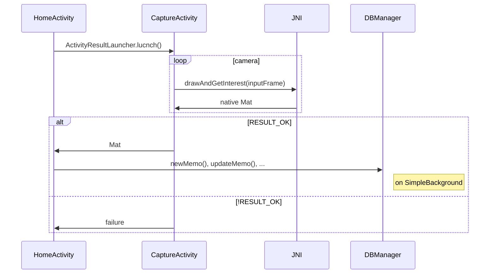
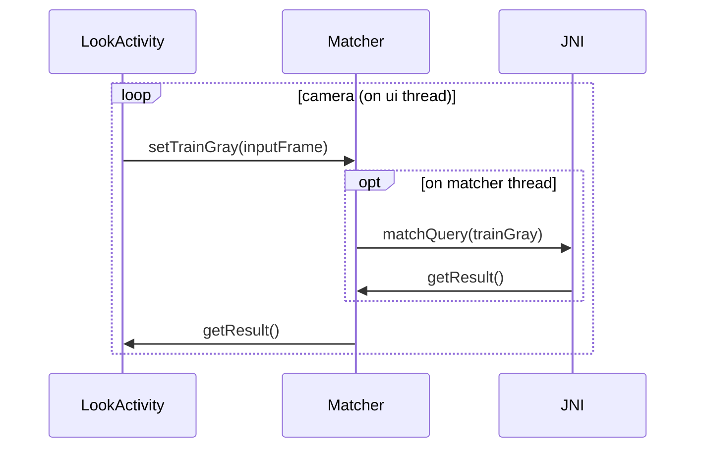
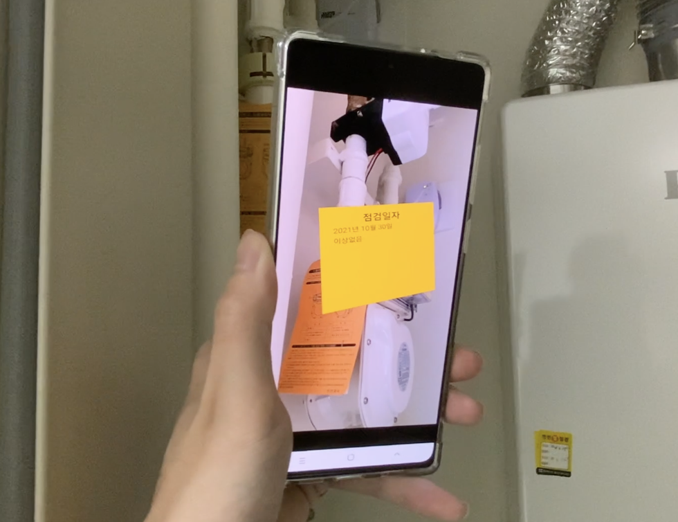

# AR Notepad, Look-it

이 레포지토리는 "기계설비 기반 SW 융합인적자원 생태계 조성사업"의 지원을 받아 진행한 연구과제임을 알립니다.

  

### 메모 부착과정

```mermaid
sequenceDiagram
    participant HomeActivity
    participant CaptureActivity
    participant JNI
    participant DBManager
    
    HomeActivity ->> CaptureActivity: ActivityResultLauncher.lucnch()
    
    loop camera
        CaptureActivity ->> JNI: drawAndGetInterest(inputFrame)
        JNI ->> CaptureActivity: native Mat
    end
    
    alt RESULT_OK
        CaptureActivity ->> HomeActivity: Mat
        HomeActivity ->> DBManager: newMemo(), updateMemo(), ...
        Note right of DBManager: on SimpleBackground
    else !RESULT_OK
        CaptureActivity ->> HomeActivity: failure
        
    end
```

### 메모 열람과정

```mermaid
sequenceDiagram
    participant LookActivity
    participant Matcher
    participant JNI
    
    loop camera (on ui thread)
        LookActivity ->> Matcher: setTrainGray(inputFrame)
        opt on matcher thread
            Matcher ->> JNI: matchQuery(trainGray)
            JNI ->> Matcher: getResult()
        end
        Matcher ->> LookActivity: getResult()
    end
```

